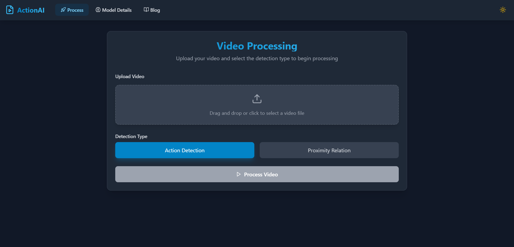
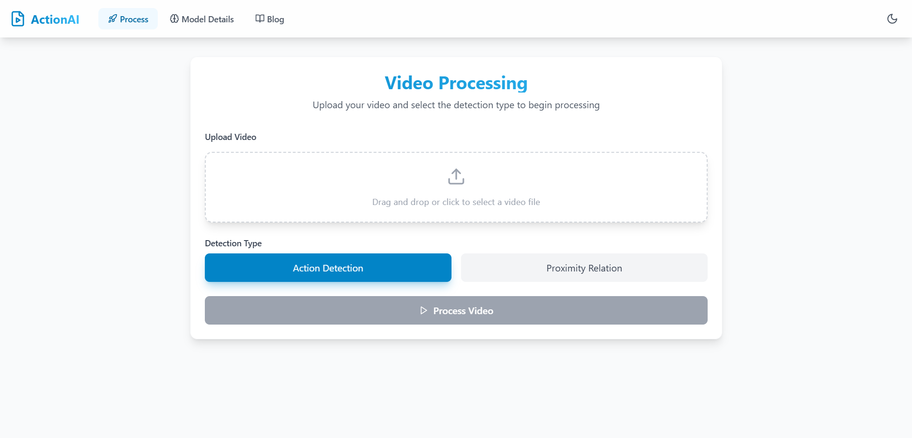
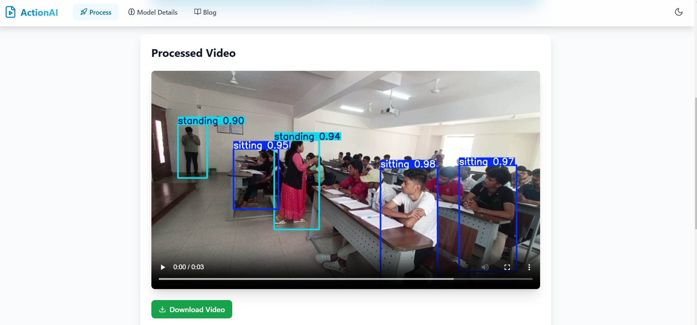
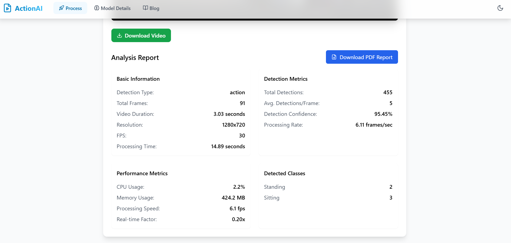
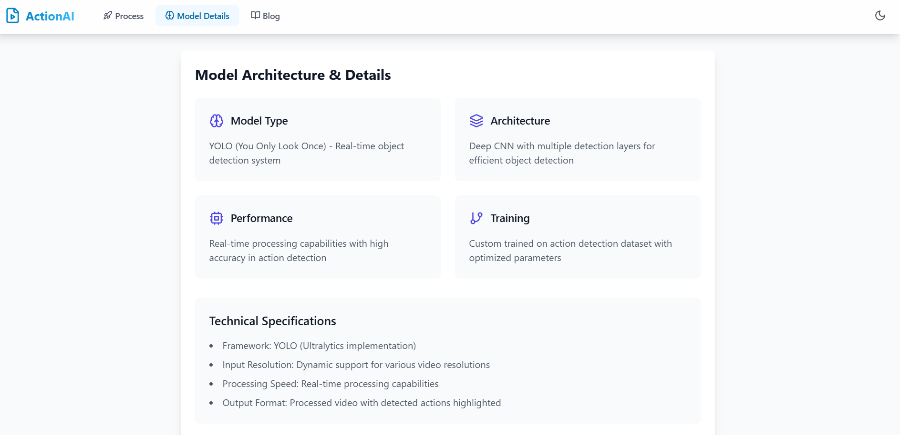

# Action Detection in Classroom Environment

This repository contains the code and resources for an Action Detection project designed to monitor and identify various classroom behaviors, such as sitting, standing, and other activities. This project leverages YOLO (You Only Look Once) for real-time object and action detection within video data.

## Table of Contents

- [Project Overview](#project-overview)
- [Features](#features)
- [Dataset](#dataset)
- [Installation](#installation)
- [Usage](#usage)
- [Demo](#demo)

## Project Overview

The objective of this project is to create a system that can detect irregular behaviors in classroom environments, such as a student standing, sitting, or other specific actions that may indicate irregular activities. This system is particularly useful for automated surveillance and monitoring in educational settings.

Key technologies used:
- **YOLO (You Only Look Once)**: A deep learning model used for real-time object detection.
- **React**: Used for building the frontend interface, where users can upload video files for processing and view detected classes.
- **jsPDF**: Utilized to generate reports of detected actions.

## Features

- **Real-Time Action Detection**: Detects actions within the classroom environment, classifying them as sitting, standing, etc.
- **Frontend Interface**: User-friendly interface for video upload and detection results display.
- **Export Reports**: Generates reports of detected actions in PDF format.
- **Dynamic Labeling**: Maps numeric detection results (0.0, 1.0) to labels like 'sitting' and 'standing.'

## Dataset

We used a custom dataset of classroom videos containing annotations of different actions related to classroom behavior. The dataset primarily consists of actions like:
- Sitting
- Standing
- Walking
- Writing
- using Phone, etc.

You can modify or expand this dataset according to your specific requirements.

## Installation

1. **Clone the repository**:
   ```bash
   git clone https://github.com/Prajwal-KS/Action-Detection
   cd action-detection
   ```

2. **Set up the project**:

    Install dependencies:
    ```bash
    pip install -r requirements.txt
    ```

    ```bash
   cd frontend
   npm install
   npm install lucide-react
   ```

   - Install required libraries (If missed in requirements)

3. **Configuration**:

    Modify any configuration settings as needed (e.g., file paths, model parameters).

## Usage

1. **Run backend**

    ```bash
    cd backend
    pip install uvicorn
    uvicorn vid:app --reload
    ```

2. **Run frontend**

    ```bash
    cd frontend
    npm run dev
    ```

# Demo:


**DUser Interface(Dark mode)**


**User Interface(Light mode)**


**Processed Video**


**Analysis Report**


**Model Details**
